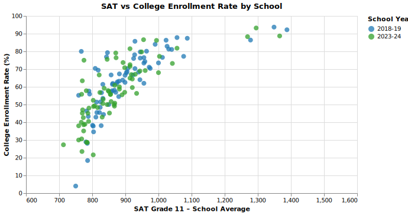

# Exploring Factors Shaping Academic Outcomes in Chicago Public High Schools
*Yufei Mao*

## What is your current goal? Has it changed since the proposal?
My current goal remains consistent with my proposal: to provide descriptive insights into Chicago public high schools and to explore how factors such as family background, school resources, teaching quality, and neighborhood safety relate to academic outcomes.

## Are there data challenges you are facing? Are you currently depending on mock data?
The datasets I selected are large and comprehensive, so I am working with real data. However, one challenge is the limited amount of quantitative measures for certain contextual variables, which requires me to use diverse visualization methods to represent the data meaningfully.

## Describe each of the provided images with 2–3 sentences to give context and explain how it relates to your goal.
Below are embedded SVG images with their descriptions:  

**Plot 1. Academic Outcome Overview**
  
This figure illustrates the trend in graduation and college enrollment rates among Chicago public high school students from 2011 to 2024. While graduation rates have shown a steady increase over time, college enrollment rates have declined between 2019 and 2024. Such pattern might be explained by the post-pandemic financial stagnation.

**Plot 2. Student & Teacher Engagement**  
  
The figure compares student and teacher attendance across three academic years (2011–12, 2018–19, and 2023–24). Overall, teacher attendance remains consistently high around 95–100%, while student attendance shows more variability and tends to be lower, especially in recent years.

**Plot 3. School Safety**  
  
The figure shows school safety levels across academic years. In general, most schools fall into the weak or very weak safety categories, with relatively few rated as strong or very strong, suggesting limited improvement in perceived safety over time.

**Plot 4. School Safety in Density**  
  
This aggregated heatmap visualizes the density of schools within each safety category over time. The concentration of darker shades in the weak category, showing that a majority of schools continue to report low safety levels.

**Plot 5. SAT Scores in College Enrollment**  
  
This figure illustrates the relationship between average SAT scores and college enrollment rates for Chicago public high schools in 2018–2019 and 2023–2024. Schools with higher average SAT scores tend to have higher college enrollment rates, confirming the important role standardized test scores play in college admissions. Although I initially hypothesized that the influence of SAT scores would weaken in 2023–2024 compared to 2018–2019 due to many colleges adopting test-optional policies after COVID-19.

**Plot 6. Factors Influencing Student Attendance**  
  
This figure examines how different factors relate to student attendance rates. Higher evaluation scores in schools' environment and teachers' instruction are associated with stronger attendance, while family involvement shows a weaker but still positive relationship. Together, these results suggest that supportive school environments and effective instruction play a key role in promoting student attendance in classes.

**Plot 7. Creativity in Lines**  
  
This line chart illustrates how schools’ creativity evaluations have shifted from 2018–2019 to 2023–2024. The proportion of schools rated as strong or excelling increased, while those in the emerging and developing categories declined, suggesting an overall improvement in creativity-focused outcomes. One possible explanation is that creativity criteria were not included in earlier datasets (such as 2011–2012), but as educational priorities evolved, schools began placing greater emphasis on developing students’ creative skills and competencies. 

**Plot 8. Creativity in Bars**  
  
This stacked bar chart shows the distribution of schools across four creativity certification levels in 2018–2019 and 2023–2024. The share of schools rated as strong and excelling increased over time, while those in the emerging and developing categories declined. Connecting to what we learned in class, the stacked bar chart is an effective choice because it clearly highlights the proportion of schools within each level. However, as I mentioned in my code comments, I am particularly interested in examining how this emphasis on creativity evolves over a longer period. Hence, I plan to incorporate additional datasets to determine whether a line graph or a stacked bar chart would better represent the long-term trend.

## What form do you envision your final narrative taking?
I plan to present my final narrative in the form of an academic poster that highlights both the descriptive information and the associations between the topics I explored. Unlike an academic paper, a poster emphasizes visual communication through figures and brief explanations. Moreover, posters are typically printed for display. Hence, I would pay close attention to color choices, layout, as well as clarity. 
