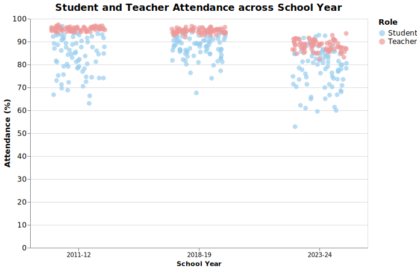

# Exploring Factors Shaping Academic Outcomes in Chicago Public High Schools
Yufei Mao

## What is your current goal? Has it changed since the proposal?
My current goal remains consistent with my proposal: to provide descriptive insights into Chicago public high schools and to explore how factors such as family background, school resources, teaching quality, and neighborhood safety relate to academic outcomes.

## Are there data challenges you are facing? Are you currently depending on mock data?
The datasets I selected are large and comprehensive, so I am working with real data. However, one challenge is the limited amount of quantitative measures for certain contextual variables, which requires me to use diverse visualization methods to represent the data meaningfully.

## Describe each of the provided images with 2–3 sentences to give context and explain how it relates to your goal.
Below are embedded SVG images with their descriptions:  

**Plot 1. Academic Outcome Overview**
  
This figure illustrates the trend in graduation and college enrollment rates among Chicago public high school students from 2011 to 2024. While graduation rates have shown a steady increase over time, college enrollment rates have declined between 2019 and 2024. Such pattern might be explained by the post-pandemic financial stagnation.

**Plot 2. Academic Progress and School Environment**  
  
This visualization compares academic progress metrics with school environmental ratings to explore potential correlations between perceived school quality and outcomes.

## What form do you envision your final narrative taking?
I plan to present the final narrative as a data-driven article that integrates visualizations and written analysis, emphasizing how environmental and institutional factors interact to shape academic outcomes. Alternatively, I may format it as an infographic summarizing key findings for a broader audience.
